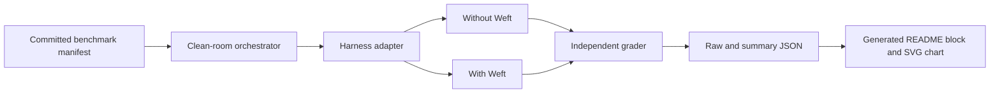

# Skill Benchmark Runner Architecture

## Purpose

The runner lets a user measure the marginal effect of Weft on an agent task.
It runs the same task twice with the same harness, model, safety policy, and fixtures:

1. `without_weft`: no Weft skill is available;
2. `with_weft`: the selected Weft skill set is available.

The public result has three dimensions only: end-to-end time, full-task
accomplishment rate, and total agent tokens.

## Boundary

The orchestrator owns isolation, paired scheduling, telemetry normalization,
error classification, aggregation, and publication. An adapter only builds a
non-interactive harness command and extracts its final answer and native token
telemetry. The manifest owns prompts, fixtures, repetitions, skill paths,
grading checks, and truth provenance.

V0 permits real runs only on POSIX hosts. Windows process-tree termination and
Codex filesystem-deny enforcement are not sufficient for publishable isolation.
Dry-run planning remains available on all hosts.

## Clean-room contract

The runner copies the complete execution trees into one immutable snapshot
before the first run. Each run then uses a new temporary directory. It contains
only the task fixtures and, for the `with_weft` arm, copied execution files from
the selected skill directories. Skill READMEs, benchmark manifests, benchmark results, workspace
`AGENTS.md`, unrelated skills, and prior outputs are absent. The skill digest
covers that same execution tree, so publishing a README does not invalidate its
own evidence or expose grader checks to the measured agent.

Codex runs with project-local `.agents/skills`, an ephemeral session, user
configuration disabled, and repository rules ignored while retaining its normal
authentication mechanism. A strict Codex permission profile denies root reads,
allows only the platform's minimal runtime files, and gives the clean-room
directory read-write access. Model shell commands inherit none of the caller's
environment. Hosted web search, skill search, apps, browser and computer tools,
image generation, plugins, and multi-agent execution are disabled. The runner also passes disabled entries for
every discovered non-system global and plugin skill. This prevents a
user-installed copy of the tested skill from leaking into the baseline. Harness
processes receive an allowlist of runtime, configuration, and provider
authentication variables; unrelated caller secrets are not inherited. Pi runs
with tools, context files, extensions, prompt templates, and discovered skills
disabled. Each Pi run gets a clean agent directory with only a copied
`auth.json`; global settings, model overrides, sessions, and packages are not
loaded. Pi install telemetry and version checks are disabled. Both Pi arms
receive the same explicit base and append system prompts,
which suppress machine-specific prompt files. For Pi's `with_weft` arm, the
runner adds the immutable text skill files in a second system-prompt bundle.
This lets Pi use instruction-only skills without a file or shell tool. V0 Pi
benchmarks cannot execute skill scripts or call external services.

Fixture paths must be below `fixtures/` in the clean room. They cannot create
`AGENTS.md`, skill directories, or other harness instruction files. Codex reads
the files in the clean room. Pi has no tools, so the runner supplies the same
fixture path and content in a delimited JSON task-input bundle.

## Metric contract

| Dimension | Definition |
|---|---|
| Time | Wall-clock seconds from child-process start to exit. Public summaries use the median of valid runs. |
| Accomplishment rate | Fully accomplished valid runs divided by all valid runs. A run is accomplished only when every committed check passes. |
| Tokens | Total native tokens reported by the harness for the task agent, including its subagents when the harness reports them. Pi uses `totalTokens`, which includes input, output, cache-read, and cache-write categories exactly once. Public summaries use the median. |

Missing token telemetry makes a run `unmeasurable`; it is never recorded as
zero. Authentication failures, unavailable models, timeouts, malformed harness
output, and tool-connection failures are exclusions. The summary publishes each
exclusion count and reason. Grader time and tokens are not agent-task telemetry.

## Accomplishment and truth

The manifest declares checks before execution. V0 supports deterministic
regular-expression checks over the final user-visible answer. Every manifest
also names its truth provenance. A check written from the skill output or from a
result generated by the measured arm is invalid. Later grader adapters can add
domain-specific verification, but they must preserve this provenance boundary.

## Harness adapters

V0 has two adapters:

- `codex:<model>` uses `codex exec --json --ephemeral` and reads native usage
  from the final turn event;
- `pi:<provider/model>` uses `pi --print --mode json --no-session` and reads
  native usage from the returned message/session data.

The model identifier is user input. The runner never claims that an installed
catalog entry is authenticated. Adapter preflight or process output can mark a
target unmeasurable with a specific reason.

## Results and README publication

The raw result records the prompt ID, arm, repetition, harness version and model
identifier, skill-tree digest, manifest digest, duration, token count,
accomplishment checks, final answer, and exclusion. The summary contains only
aggregate facts derived from raw valid runs.

`publish` replaces a marker-bounded section in the skill README and writes a
deterministic SVG to `benchmarks/chart.svg`. The README embeds that stable path.
The chart shows side-by-side `without_weft` and `with_weft` values for time,
accomplishment rate, and tokens. It writes one table row per harness/model/arm
plus the with-Weft delta and links the committed raw result. Before writing, it
reloads the current manifest and skill files, rereads
each sibling `answer.md`, re-runs the committed checks, and recomputes the
aggregates. It requires the minimum number of valid pairs for every target and
every case. It refuses partial cases, changed aggregates, stale skill or
manifest digests, evidence outside the skill, missing telemetry, duplicate
runs, or incomplete case coverage. An unmeasured skill README states that no
result has been published, and its chart shows an explicit unmeasured state. It
does not show zeros. Repository validation reproduces measured charts from raw
evidence and rejects missing or stale chart files.

## Safety

- Paid Weft calls and external side effects are disabled in V0.
- The runner never prints or copies credentials.
- It gives the official harness process only an allowlist of runtime,
  configuration, proxy, and provider-authentication variables. Test harnesses
  receive no provider credentials. Codex model commands inherit none of the
  process environment, and Pi has no tools in V0. The runner never records the
  allowlisted values.
- Raw outputs can contain public task data. Maintainers inspect them before
  committing results.
- A repository-supplied manifest and grader are executable measurement inputs;
  users review the repository before running them.
