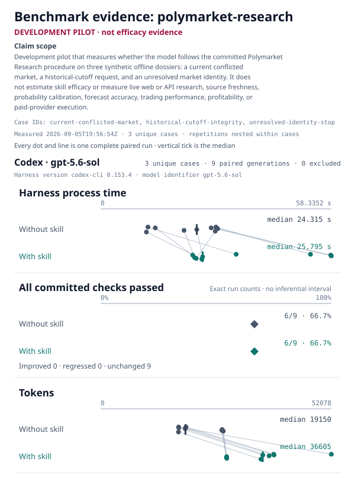

# Polymarket Research

Create a cited, timestamped decision brief from a Polymarket link. The skill
separates settlement rules, live market state, outside evidence, and inference.
It is read-only and never places a trade.

## Install

```sh
npx skills add weft-labs/skills --skill polymarket-research
```

## Reproduce the benchmark

From the repository root:

```sh
python3 scripts/benchmark.py run --manifest skills/polymarket-research/benchmarks/manifest.json --target codex:gpt-5.6-sol --out benchmark-results/polymarket-research
```

<!-- weft-benchmark:start -->
## Benchmark



**Status: Unmeasured.** No reproducible with-Weft versus without-Weft result has been published for this skill yet.
<!-- weft-benchmark:end -->
