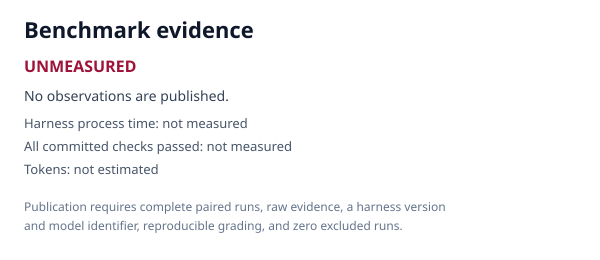

# Weft Setup

Connect a user to a Weft Account with account-level OAuth and safe optional
machine-local setup.

```sh
npx skills add weft-labs/skills --skill weft-setup
```

[Read the skill](SKILL.md)

Run its committed benchmark:

```sh
python3 scripts/benchmark.py run --manifest skills/weft-setup/benchmarks/manifest.json --target codex:gpt-5.6-sol --out benchmark-results/weft-setup
```

<!-- weft-benchmark:start -->
## Benchmark



**Status: Unmeasured.** No reproducible with-Weft versus without-Weft result has been published for this skill yet.
<!-- weft-benchmark:end -->
